# Akıllı Antrenman Asistanı: Poz Tahmini, Şınav Sayacı ve Kişi Algılama

Bu proje, bilgisayarlı görü ve makine öğrenimi tekniklerini kullanarak bir kişinin şınav egzersizini takip eden ve pozisyon hataları hakkında geri bildirimler sunan bir antrenman asistanıdır. Proje, gelişim sürecini gösteren iki aşamadan oluşmaktadır.

---

## Proje Amacı

Bu projenin temel amacı, modern bilgisayarlı görü kütüphaneleriyle **gerçek zamanlı poz tahmini** ve **nesne algılama** yeteneklerini birleştirerek sporcular için etkileşimli bir antrenman deneyimi sunmaktır. Bu amaç doğrultusunda, bir kişinin şınav egzersizini analiz ederek doğru formu korumasına yardımcı olmak ve antrenman verilerini kaydetmek hedeflenmiştir.

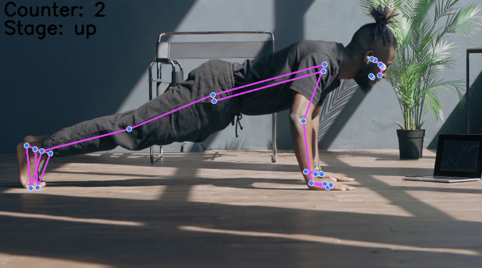
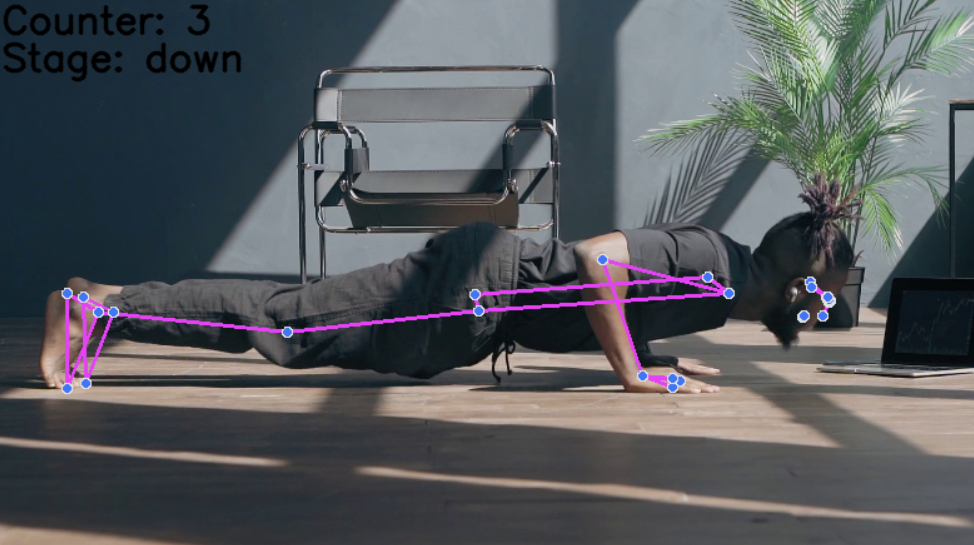
---
## Proje Aşamaları

### Aşama 1: Şınav Sayacı ve Pozisyon Analizi

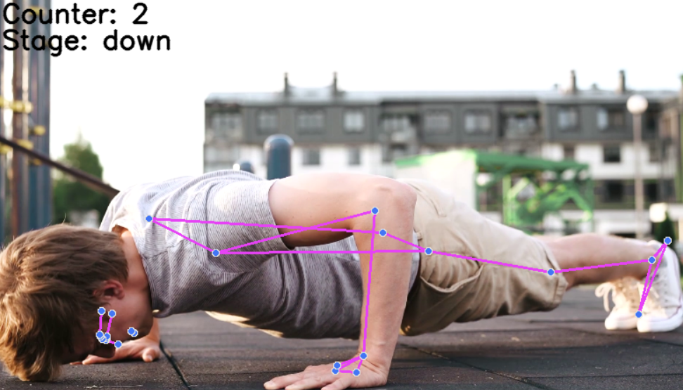

Bu ilk aşamada, temel olarak **MediaPipe Pose** kütüphanesi kullanılarak bir kişinin şınav hareketleri analiz edilir.

* **Poz Tahmini:** MediaPipe ile vücudun anahtar eklem noktaları (omuz, dirsek, kalça, bilek, ayak bileği) tespit edilir ve görselleştirilir.
* **Açı Analizi:** Dirsek ve vücut açıları, şınav hareketinin doğru bir şekilde yapılıp yapılmadığını belirlemek için kullanılır.
* **Sayaç ve Geri Bildirim:** Her başarılı şınav sayılır ve hatalı pozisyonlar için (örneğin, eğik sırt) anlık geri bildirimler verilir.
* **Antrenman Logu:** Antrenman sonunda şınav verileri (durum, süre, açılar) bir CSV dosyasına kaydedilir.

### Aşama 2: Çoklu Kişi Algılama ve Gelişmiş Şınav Takibi
Bu aşama, ilk projenin üzerine inşa edilerek daha gelişmiş özellikler ekler. **YOLOv8** modeli entegrasyonu sayesinde ortamdaki kişi sayısı tespit edilir ve MediaPipe ile poz analizi tek bir videoda birleştirilir. Bu, projenin daha dinamik ve gerçek dünya senaryolarına uygun hale gelmesini sağlar.

* **Kişi Algılama:** **YOLOv8 nano** modeli, videodaki insanları tespit eder, etiketler ve sayar.
* **Entegre Takip:** Projemiz birden fazla kişi algılasa da neden hala sadece bir kişinin şınavını sayıyor? Bunun temel sebebi, bilgisayarlı görüde çoklu kişi poz takibini mümkün kılan farklı yaklaşımlardır:
    * **"Top-Down" (Yukarıdan Aşağıya) Yaklaşımı:** Önce bir nesne algılama modeli (YOLO gibi) ile görüntüdeki tüm kişileri tespit edip her biri için bir sınır kutusu (`bounding box`) çizilir. Ardından, her bir kutunun içindeki kişiye özel olarak poz tahmini yapılır. **Bu projenin ilerleyen aşamalarında hedeflenen ve şu anda kısıtlı bir şekilde uygulanan yaklaşımdır.**
    * **"Bottom-Up" (Aşağıdan Yukarıya) Yaklaşımı:** Bu yaklaşımda önce görüntüdeki tüm eklem noktaları (omuz, dirsek vb.) tespit edilir. Sonra bir algoritmik süreçle bu eklemlerin hangi kişiye ait olduğu eşleştirilerek vücut iskeletleri oluşturulur. Bu yöntem, genellikle daha hızlıdır ancak "Top-Down" yaklaşımı kadar doğru sonuçlar vermeyebilir.
    Bu projede, Top-Down yaklaşımının temelleri atılmıştır ancak her kişi için ayrı poz tahmini yapılmamaktadır. Bu, projenin gelecekteki geliştirmeleri için harika bir potansiyel sunuyor!
* **Geliştirilmiş Geri Bildirim:** Şınav sayacı, geri bildirimler ve antrenman loglama özellikleri korunarak daha kapsamlı bir çözüm sunulur.

---

## Kullanılan Teknolojiler

-   **Python:** Projenin ana programlama dilidir.
-   **YOLOv8:** Gerçek zamanlı nesne algılama için kullanılır.
-   **MediaPipe:** Gerçek zamanlı vücut pozisyonu tahmini için kullanılır.
-   **OpenCV (`cv2`):** Video akışı okuma, işleme ve görselleştirme işlemleri için kullanılır.
-   **Numpy:** Matematiksel hesaplamalar ve açı analizleri için kullanılır.
-   **Supervision:** YOLOv8 sonuçlarını kolayca görselleştirmek için kullanılır.
-   **CSV:** Antrenman verilerini kaydetmek için kullanılır.

---

## Kurulum

Projeyi yerel makinenizde çalıştırmak için aşağıdaki adımları izleyin:

1.  **Python Ortamı Oluşturma:** Python 3.8 veya üzeri yüklü olduğundan emin olun ve sanal ortam oluşturun:

    ```bash
    python -m venv venv
    source venv/bin/activate # Linux/macOS
    .\venv\Scripts\activate   # Windows
    ```

2.  **Bağımlılıkların Yüklenmesi:** Gerekli tüm kütüphaneleri `pip` kullanarak yükleyin:

    ```bash
    pip install opencv-python mediapipe ultralytics supervision numpy
    ```

3.  **Model Ağırlıklarının İndirilmesi:** YOLOv8 nano model ağırlıkları (`yolov8n.pt`), ilk çalıştırmada otomatik olarak indirilecektir.

---

## Kullanım

### Proje Yapısı

Projenin temel dizin ve dosya yapısı aşağıdaki gibidir:

    ├── log/                          # Antrenman verilerinin (CSV) kaydedildiği klasör
    ├── output/                       # İşlenmiş çıktı videolarının kaydedildiği klasör
    ├── videos/                       # Giriş video dosyalarının bulunduğu klasör
    ├── countPeoplePose.py            # Aşama 2'ye ait ana uygulama kodu
    ├── pose.py                       # Proje hazırlık aşamasına ait uygulama kodu
    ├── pushUpCounter.py              # Aşama 1'e ait uygulama kodu
    ├── pushUpLog.py                  # Şınav sayacına loglama özelliği ekleyen uygulama kodu
    └── yolov8n.pt                    # YOLOv8 nano model ağırlık dosyası

1.  İşlemek istediğiniz video dosyasını projenin `videos/` klasörüne yerleştirin.
2.  Python kodunda `video_source` değişkenini kendi video dosyanızın yolunu gösterecek şekilde güncelleyin.

> **Video Kaynağı Önerisi:** Kendi videolarınız yoksa veya farklı şınav videolarıyla deneme yapmak isterseniz, telifsiz video platformlarından (örneğin, **Pexels**, **Vecteezy**, **Adobe Stock**) anahtar kelimelerle arama yaparak videolar indirebilirsiniz. Arama yaparken "push up", "push up counter", "push up training" gibi anahtar kelimeler kullanabilirsiniz.

3.  Proje klasörünün içerisinde `output` ve `log` adında klasörler oluşturun.
4.  Ana Python betiğini çalıştırın.

---

## Proje Çıktısı Örnekleri

### Proje Hazırlık Aşaması: Poz Tahmini
Bu görsel, projenin en temel aşamasını, yani sadece MediaPipe'in bir kişinin vücut eklemlerini nasıl tespit ettiğini gösterir. Bu, tüm analizin temelini oluşturan ilk adımdır.
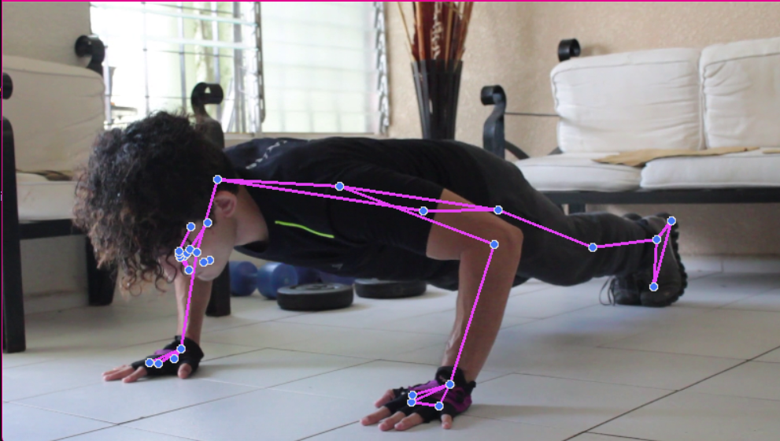

### Proje Aşaması 1: Şınav Sayacı ve Loglama

#### Şınav Sayacı ve Geri Bildirim
Bu görsel, MediaPipe'in eklemleri tespit ederek şınav hareketini takip ettiği anı gösterir. Ekranda sayacı ve pozisyon durumunu görebilirsiniz.
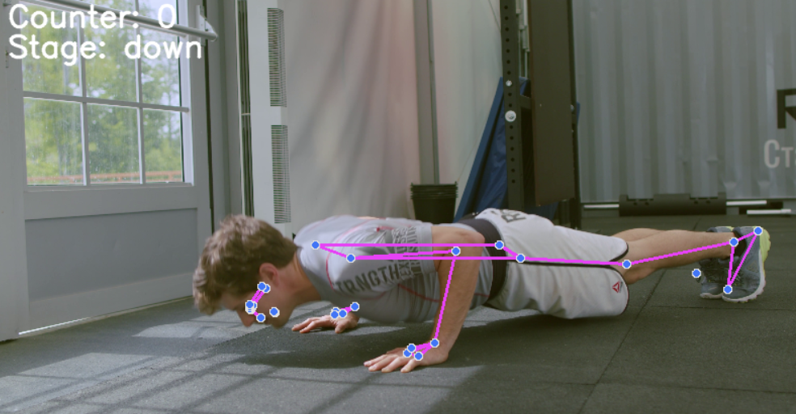
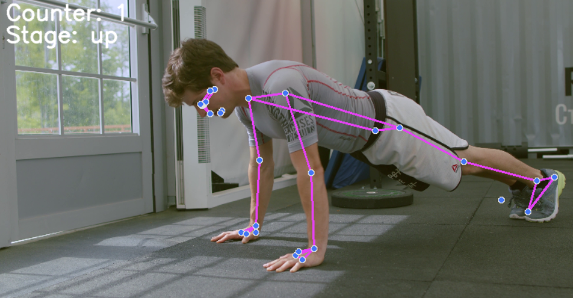
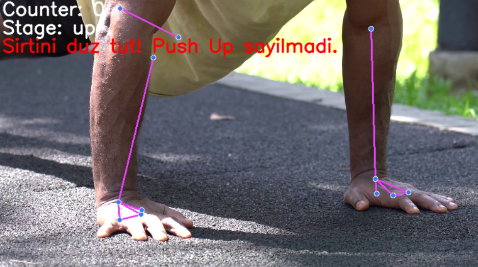

#### Antrenman Log Dosyası
Bu görsel, projenin ilk aşamasında oluşturulan ve her bir şınav denemesi hakkında detaylı veriler içeren CSV dosyasından bir kesiti gösterir.
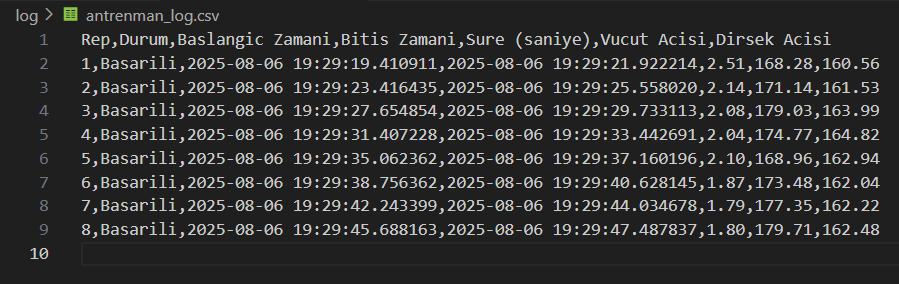
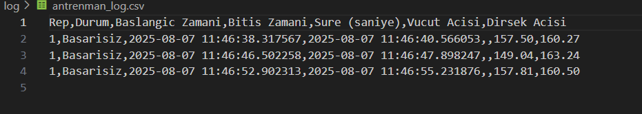


### Proje Aşaması 2: Entegre Sistem

#### Çoklu Kişi Algılama (YOLOv8)
Bu görsel, YOLOv8 modelinin ortamdaki insanları tespit edip saydığı ve her birini etiketlediği bir anı gösterir.
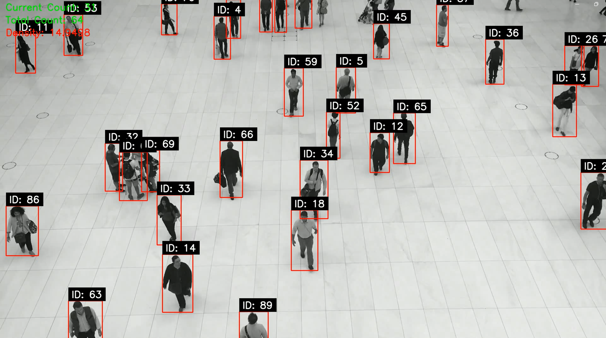

#### Entegre Uygulama Ekranı
Bu görsel, son projenin ekran çıktısını gösterir. Aynı anda hem kişi sayısı hem de şınav sayacı ekranda yer almaktadır.
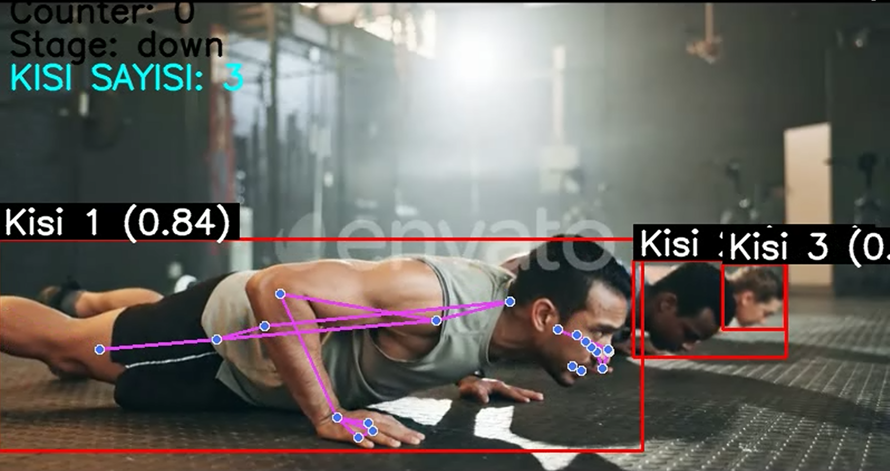
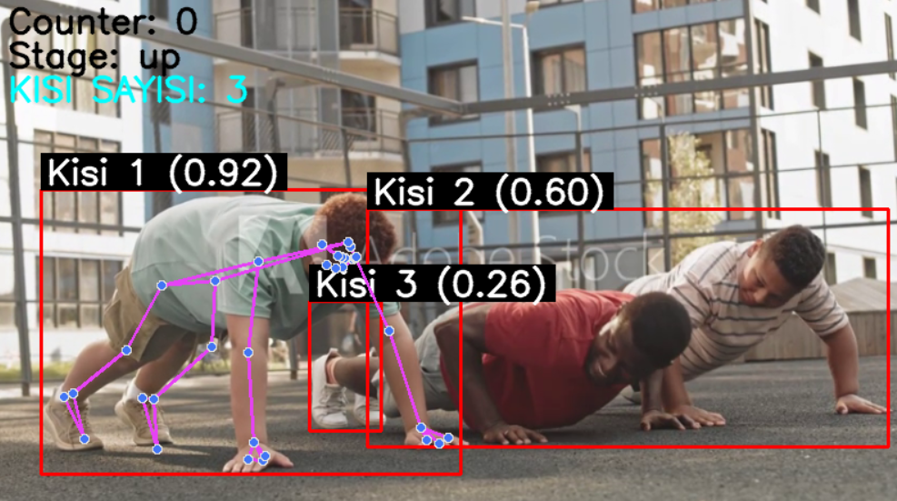
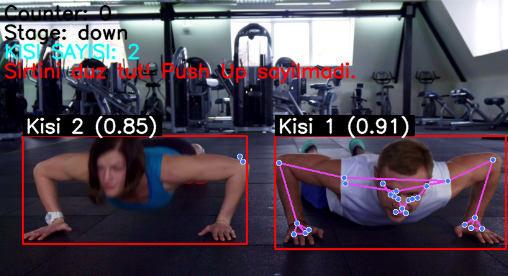

