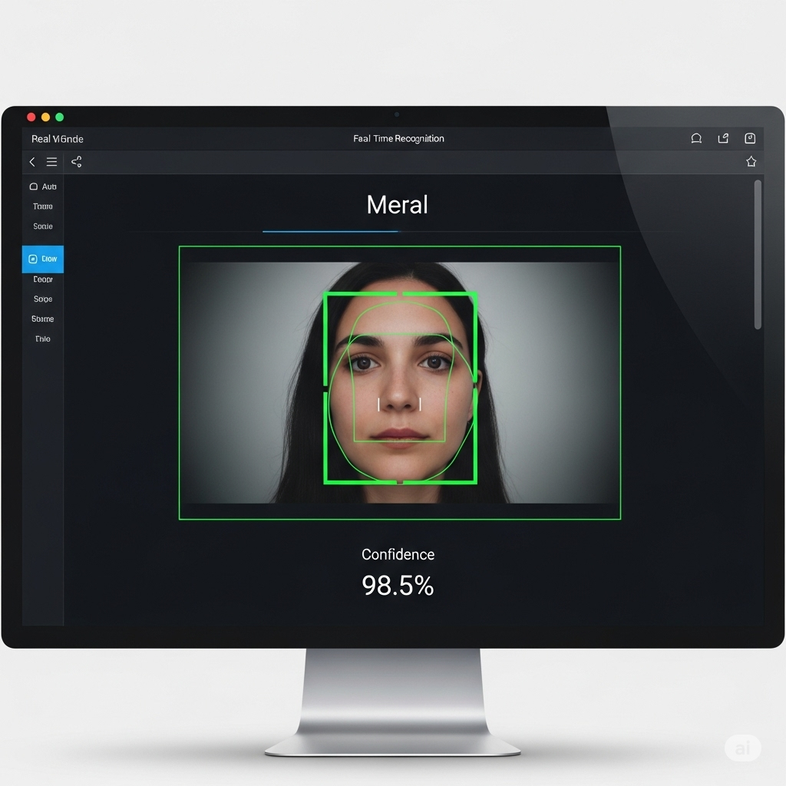

# Yüz Tanıma Projesi (OpenCV)

Bu proje, OpenCV kütüphanesi kullanılarak geliştirilmiş gerçek zamanlı bir yüz tanıma uygulamasıdır. Canlı kamera görüntüsündeki yüzleri tanır ve üzerine kişinin adını yazar.

* Kamera açıldığında, tanıdığı yüzlerin üzerine isimlerini yazacak ve kutuyu yeşile çevirecektir.



***

## Kurulum ve Çalıştırma

Projenin çalışması için Python ve gerekli kütüphanelerin yüklü olması gerekir.

### 1. Gerekli Kütüphaneler

Aşağıdaki komutu kullanarak projede kullanılan kütüphaneleri yükleyin:

```bash
pip install opencv-python numpy Pillow
```

2. Proje Dosyaları
Projenin ana klasöründe şu dosyaların bulunduğundan emin olun:
-dataset_olustur.py
-egitim.py
-tanima.py
-haarcascade_frontalface_default.xml

3. Kullanım
Projeyi aşağıdaki adımları sırasıyla uygulayarak çalıştırın:

Adım 1: Yüz Verilerini Toplama
Terminali açın ve dataset_olustur.py dosyasını çalıştırın:
  Program, tanınacak kişinin ismini soracaktır. İsmi girip kamera karşısına geçin.
  Program, yüzünüzün fotoğraflarını çekip otomatik olarak dataset klasörünün içine kaydedecektir.
  Başka bir kişi eklemek için bu adımı tekrarlayın.

Adım 2: Modeli Eğitme
Veri toplama işlemi bittikten sonra, modeli eğitmek için egitim.py dosyasını çalıştırın:
Bu komut, topladığınız verilerle bir yüz tanıma modeli oluşturacak ve trainer klasörüne kaydedecektir.

Adım 3: Yüz Tanımayı Başlatma
Son olarak, canlı yüz tanıma uygulamasını başlatmak için tanima.py dosyasını çalıştırın:
Kamera açıldığında, tanıdığı yüzlerin üzerine isimlerini yazacak ve kutunun rengini değiştirecektir.

Uygulamayı kapatmak için ESC tuşuna basın.
